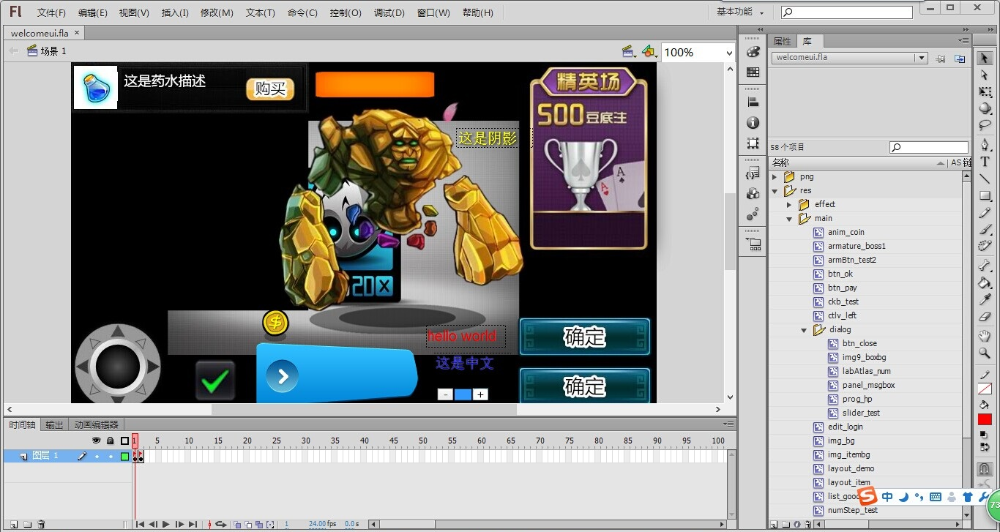
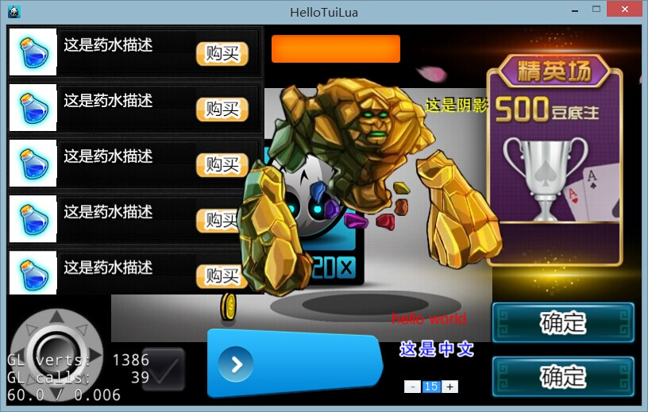

Tui-x
=====

This Tui-x cocos2dx 3.x version,more light,more sample,more flexible

简介：

<<<<<<< HEAD
Tui是一个创建cocos2d-x UI界面的解决方案，而builder用的则是FlashCS，这个项目所用的版本是cocos2d-x 3.2正式版， 而所用的组件库为CocosWidget3.2，如果是2.2.x版本的项目请移步到https://github.com/LingJiJian/tui/tree/Tui-x

特性:

0.持续更新，伴随官方的最新引擎发布。
1.Tui-x3.x 所采用的是RapidXml解析库，效率是tinyxml的50倍。
2.可视化编辑文本描边和阴影和对齐。
3.可视化编辑ListView，TableView，GridView等复合控件。
4.支持添加命名空间，避免资源命名冲突或过长。
5.支持多fla编辑场景。
6*.影片剪辑控件MovieView，支持自定义事件，用于制作长时间动画。动画编辑工具后期发布。
7.包含旋转菜单控件。
8.兼容lua和cpp。
9.资源管理全部交由开发者控制，自由，控件资源可跨场景重用。
10.支持自适应多分辨率

说明:

注：本项目中的HelloTuiLua/Cpp 是演示工程，需要自己放置引擎代码到相应的位置。
Cpp具体操作：下载好的cocos2dx3.x的引擎，然后直接把这个引擎改名成cocos2d，复制到Tui-x/HelloTuiCpp下，
=======
Tui是一个创建cocos2d-x UI界面的解决方案，而builder用的则是FlashCS，这个项目所用的版本是cocos2d-x 3.2正式版，
而所用的组件库为CocosWidget3.2，如果是2.2.x版本的项目请移步到https://github.com/LingJiJian/tui/tree/Tui-x

特性:

0.持续更新，伴随官方的最新引擎发布。                            
1.Tui-x3.x 所采用的是RapidXml解析库，效率是tinyxml的50倍。		    
2.可视化编辑文本描边和阴影和对齐。							            
3.可视化编辑ListView，TableView，GridView等复合控件。     
4.支持添加命名空间，避免资源命名冲突或过长。				  							
5.支持多fla编辑场景。															            			
6*.影片剪辑控件MovieView，支持自定义事件，用于制作长时间动画。动画编辑工具后期发布。	
7.包含旋转菜单控件。		                                       
8.兼容lua和cpp。                                      
9.资源管理全部交由开发者控制，自由，控件资源可跨场景重用。						

说明:

注：本项目中的HelloTuiLua/Cpp 是演示工程，需要自己放置引擎代码到相应的位置。					
Cpp具体操作：下载好的cocos2dx3.x的引擎，然后直接把这个引擎改名成cocos2d，复制到Tui-x/HelloTuiCpp下，			
>>>>>>> 3bd80b4b95adb17960ea0aea9ab50e475c289d30
Lua具体操作：下载好的cocos2dx3.x的引擎，然后直接把这个引擎改名成cocos2d-x，复制到Tui-x/HelloTuiLua/frameworks下。

接下来双击sln就可以开始编译了！

<<<<<<< HEAD
教程： 注意：Tui-x 3.x和Tui-x 2.2.x接口有少量区别！具体请看HelloTui
教程：http://blog.csdn.net/ab342854406/article/details/37706111
=======
教程：
注意：Tui-x 3.x和Tui-x 2.2.x接口有少量区别！具体请看HelloTui							
教程：http://blog.csdn.net/ab342854406/article/details/37706111
>>>>>>> 3bd80b4b95adb17960ea0aea9ab50e475c289d30
