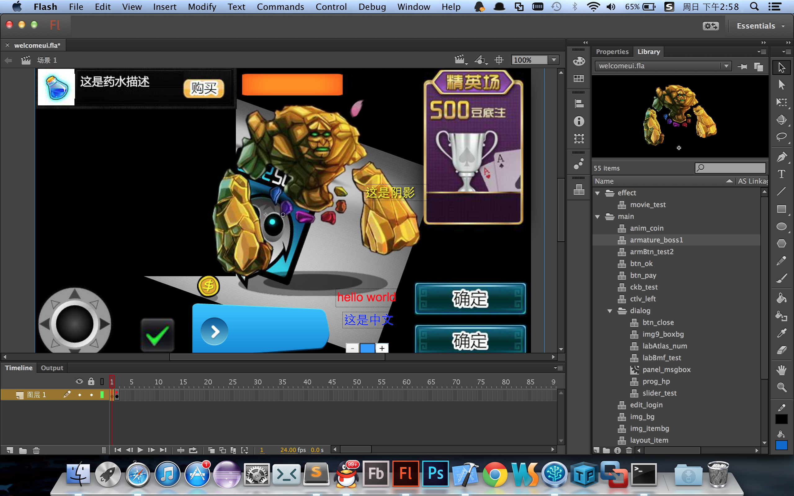

Tui-x
=====

This Tui-x cocos2dx 3.x version,more light,more sample,more flexible

简介：

Tui是一个创建cocos2d-x UI界面的解决方案，而builder用的则是FlashCS，这个项目所用的版本是cocos2d-x 3.x正式版，
而所用的组件库为CocosWidget3.x，如果是2.2.x版本的项目请移步到https://github.com/LingJiJian/tui/tree/Tui-x

特性:

0.持续更新，伴随官方的最新引擎发布。
1.Tui-x3.x 采用RapidXml解析库。
2.可视化编辑文本描边和阴影和对齐。
3.可视化编辑ListView，TableView，GridView，ExpandableListView等复合控件。
4.支持添加命名空间，避免资源命名冲突或过长。
5.支持多fla编辑场景。
6.包含旋转菜单控件。
7.兼容lua和cpp。
8.资源管理全部交由开发者控制，自由，控件资源可跨场景重用。
9.支持自适应多分辨率			
10.富文本支持可视化编辑：可复用、下划线、点击回调数据、动画、英文分词和utf8准确换行。
11.优化创建组件的方式
12.CocosBase支持悬浮层和局部点击区，Guide利器
13.合并tilemap地图编辑器，带A*，可直接开发mmoarpg
14.支持国际化i18n
15.可选择是否导出lua的ui文件

说明:

注：本项目中的HelloTuiLua/Cpp 是演示工程，需要自己放置引擎代码到相应的位置。
Cpp具体操作：下载好的cocos2dx3.x的引擎，然后直接把这个引擎改名成cocos2d，复制到Tui-x/HelloTuiCpp下，
Lua具体操作：下载好的cocos2dx3.x的引擎，然后直接把这个引擎改名成cocos2d-x，复制到Tui-x/HelloTuiLua/frameworks下。

如果编译的是Cpp，要把CocosWidget/WidgetMacros.h 和 
dragonbones/renderer/cocos2d-x-3.2/dbccMacro.h 里的USING_LUA设置成0，反之为1

接下来双击sln就可以开始编译了！

注意：Tui-x 3.x和Tui-x 2.2.x接口有少量区别！具体请看HelloTui							
教程：http://blog.csdn.net/ab342854406/article/details/37706111

Tips：
之前的img9的九宫图看起来不直观,新增了TuiMakeImg9.jsfl,使用过程请看注释。(该脚本不影响TuiEditor_Export.jsfl工作)